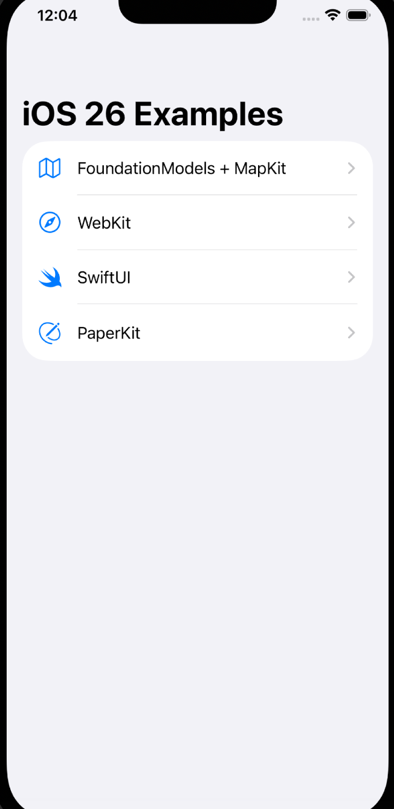
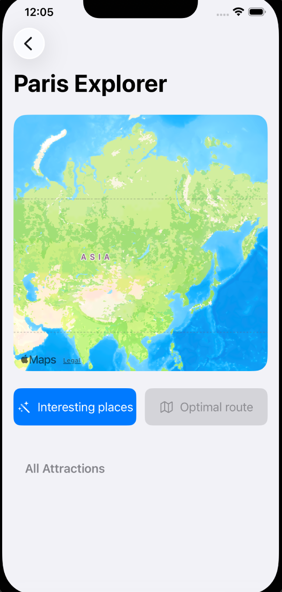
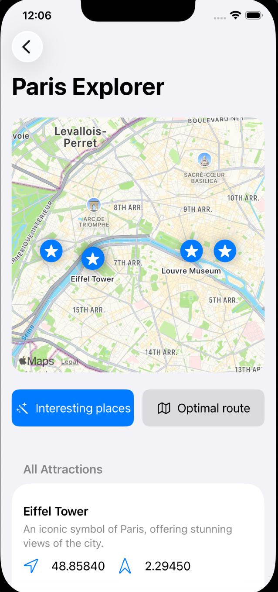
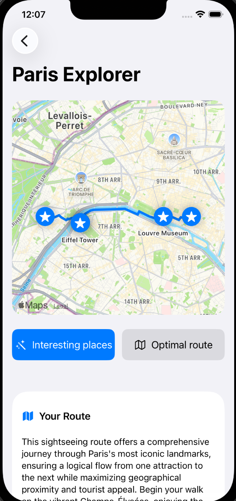
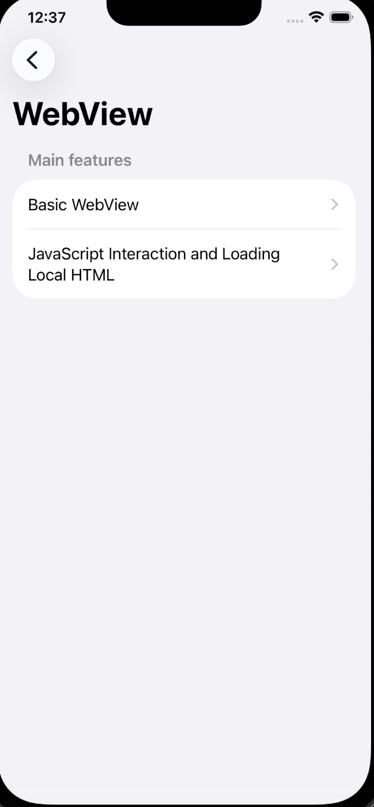
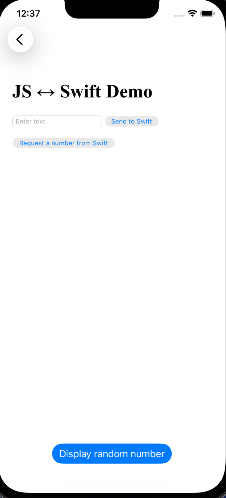
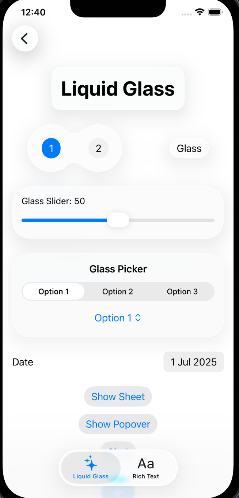
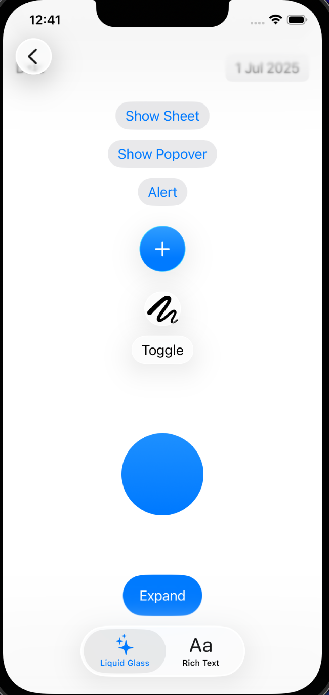
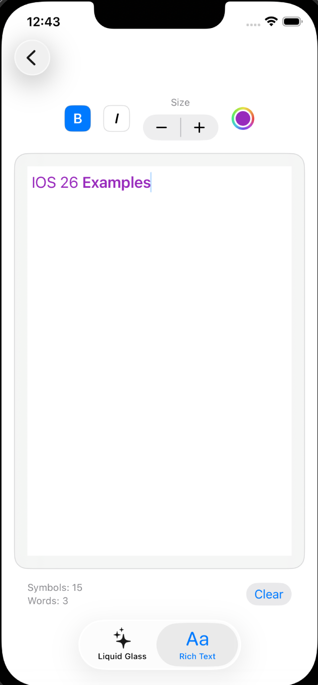
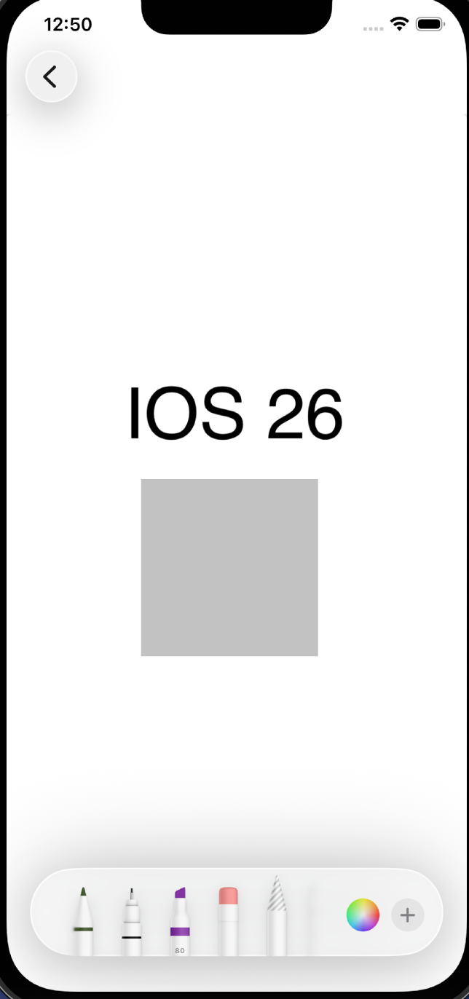

# iOS 26 by Examples

Code examples for new APIs of iOS 26.
**Note:** The project requires Xcode 26+, Swift 6.2+ and iOS 26+.

## Table of Contents

- [FoundationModels + MapKit](#foundationmodels-mapkit)
- [WebKit](#webkit)
- [SwiftUI](#swiftui)
- [PaperKit](#paperkit)

### [FoundationModels](https://developer.apple.com/documentation/foundationmodels) + [MapKit](https://developer.apple.com/documentation/mapkit/mapkit-for-swiftui)
A demo of FoundationModels in action to create a city itinerary

### [WebView](https://developer.apple.com/documentation/webkit/webkit-for-swiftui)
New features for working with web pages in SwiftUI apps

### [SwiftUI](https://developer.apple.com/swiftui/whats-new/)
Various examples showcasing the latest SwiftUI features in iOS 26

### [PaperKit](https://developer.apple.com/documentation/PaperKit)
Drawings, shapes, and markup

